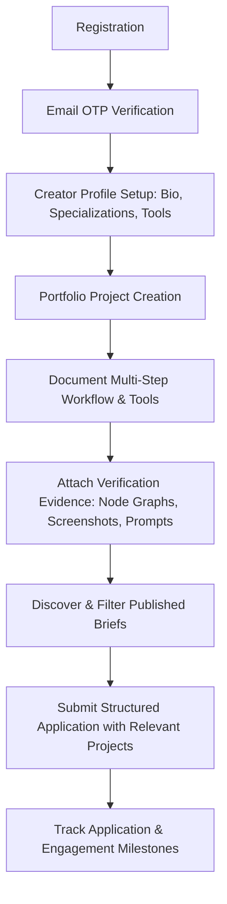
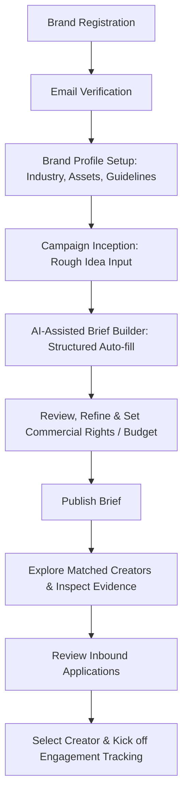
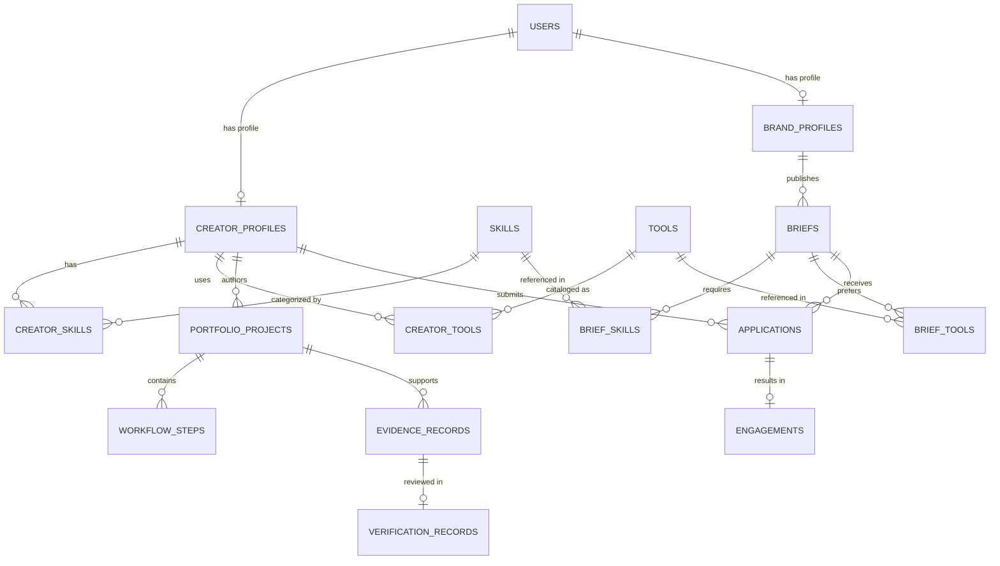

# Kivora — AI Content Creator Marketplace
## ByteXL HacXLerate 2026 Hackathon (Kampus.VC Problem Statement)

### Phase 0: Problem Understanding, Data Design & Demo Data Foundation

Kivora is an **AI-native creative marketplace** engineered specifically for the generative AI era. Unlike generic freelancer marketplaces (Upwork, Fiverr) where work is evaluated on human-hour rates and traditional portfolios, Kivora addresses the core trust and discovery bottleneck in generative creative production: **demonstrating verifiable mastery of AI models, transparent production pipelines, reproducible prompt/workflow architectures, and commercial IP safety.**

---

## 1. Product Overview & Scope

### 1.1 The Core Problem
Brands need high-caliber generative video, 3D, and visual content, but face severe friction:
1. **The "Prompt Faker" Problem:** Anyone can generate a lucky one-off image or video clip. Brands cannot discern creators capable of consistent characters, camera motion control, multi-pass refinement, and frame-accurate timing from amateurs.
2. **Workflow Opacity:** Generative production requires combining multiple models (e.g. Midjourney + ComfyUI + Flux LoRA + Runway Gen-3 + Topaz + ElevenLabs). Traditional portfolios only display the final render, hiding how the asset was made.
3. **Verification & Provenance Gap:** Brands have strict commercial and IP guidelines. They need audit trails: process screenshots, seed numbers, LoRA provenance, intermediate render checkpoints, and commercial licensing guarantees.
4. **Vague Briefs:** Brands struggle to communicate technical generative requirements (e.g., aspect ratios, camera movement descriptors, CFG scale parameters, character consistency sheets, multi-channel rights).

### 1.2 Kivora's Solution
- **AI-Native Creator Portfolios:** Rich showcases documenting not just finished media, but step-by-step production pipelines, models/tools utilized, prompt-engineering logs, and test renders.
- **Evidence-Backed Verification Tier:** Multi-dimensional verification distinguishing declared skills from verified evidence (e.g. intermediate artifacts, raw render logs, ComfyUI node graphs).
- **AI-Assisted Structured Brief Builder:** An intelligent workflow transforming rough brand concepts into comprehensive, production-ready creative briefs with technical generative parameters.
- **Explainable Multi-Vector Matching:** A deterministic, explainable algorithm that scores creator fit based on hard requirements (aspect ratio, format, budget) and weighted preferences (model mastery, workflow evidence, style overlap).
- **Commercial Usage & Rights Framework:** Granular licensing definitions (channel, territory, exclusivity, AI disclosure tags) integrated into every brief and contract.

---

## 2. User Journeys, Page Access & Authorization

### 2.1 Detailed Creator Journey


1. **Registration & Auth:** Creator signs up with email/password; receives email OTP; verifies account.
2. **Profile Setup:** Configures handle, bio, hourly/project minimums, creative disciplines (e.g., AI Filmmaking, Surreal 3D Fashion, Photorealistic Tech Visualization).
3. **Tool & Model Declarations:** Declares proficiency in specific tools (Runway Gen-3, Midjourney v6, ComfyUI, Flux.1, ElevenLabs).
4. **Portfolio Project Authoring:** Uploads high-res media (video/image/3D render), aspect ratio, resolution, runtime, and licensing terms.
5. **Workflow Step Breakdown:** Breaks down project into sequential steps (e.g. Step 1: Character LoRA Training; Step 2: Keyframe Synthesis; Step 3: Motion Generation; Step 4: 4K Upscale).
6. **Evidence Submission:** Attaches verifiable artifacts (process screenshots, intermediate frame passes, ComfyUI workflow JSON/screenshots) for review.
7. **Brief Discovery:** Explores live briefs with matching scores, filters by budget, content type, and aspect ratio.
8. **Application:** Submits tailored pitch, proposed rate/timeline, and directly links relevant verified portfolio pieces.
9. **Engagement Execution:** Tracks selection, milestone kickoff, draft delivery, and revision handoff.

### 2.2 Detailed Brand Journey


1. **Brand Registration:** Brand representative signs up with corporate email; verifies via OTP.
2. **Company Profile:** Enters brand name, industry, website, brand guidelines, and target aesthetics.
3. **Campaign Idea Entry:** Enters a rough natural language concept (e.g. *"We need a 30s cinematic cyberpunk teaser for our electric hypercar launch on Instagram Reels and YouTube 4K"*).
4. **AI Brief Builder:** Kivora's brief assistant decomposes the idea into structured specifications: format (16:9 + 9:16 cutdown), resolution (4K), required tools (Runway Gen-3, ComfyUI), style/mood, revision cycles, deliverables, and commercial usage rights.
5. **Brief Review & Publish:** Brand fine-tunes budget, deadline, territory/channel licensing, and publishes.
6. **Creator Discovery & Explainable Match:** Brand browses matched creators with transparent match breakdowns (*"95% Match: Verified Runway Gen-3 expertise, 4K video portfolio, within budget"*).
7. **Portfolio & Evidence Audit:** Brand inspects creator portfolios, stepping into the multi-stage workflow and reviewing verified evidence cards.
8. **Application Review:** Brand evaluates incoming creator pitches, compares proposed rates and attached proof-of-work.
9. **Selection & Engagement Tracking:** Brand accepts creator, transitioning the brief into active production with status milestones.

### 2.3 Page Access & Authorization Matrix

| Route / Screen | Public / Visitor | Authenticated Creator | Authenticated Brand | Admin / Reviewer |
| :--- | :---: | :---: | :---: | :---: |
| `/` (Landing Page) | Read-only | Read-only | Read-only | Read-only |
| `/creators` (Creator Discovery) | Read-only | Read & Filter | Read & Filter | Full Access |
| `/creators/:slug` (Creator Profile & Portfolio) | Read-only | Read-only (Edit own) | Read & Inspect Evidence | Full Access |
| `/briefs` (Brief Discovery) | Read-only | Read & Apply | Read & Manage Own | Full Access |
| `/briefs/:slug` (Brief Detail) | Read-only | Read & Apply | Read & Review Apps (if owner) | Full Access |
| `/briefs/create` (Brief Builder) | Redirect to Login | Denied (403) | Full Access (Create/AI Generate) | Full Access |
| `/creator/dashboard` | Redirect to Login | Full Access (Own profile/apps) | Denied (403) | Full Access |
| `/brand/dashboard` | Redirect to Login | Denied (403) | Full Access (Own briefs/apps) | Full Access |
| `/portfolio/create` | Redirect to Login | Full Access (Author project) | Denied (403) | Full Access |
| `/admin/verification` | Redirect to Login | Denied (403) | Denied (403) | Full Access (Review Evidence) |

---

## 3. Page-by-Page Frontend Specification

### Screen 1: Home / Hero (`/`)
- **Visuals:** Dark, premium glassmorphism aesthetic; dynamic banner highlighting verified AI generative masters.
- **Key Modules:**
  - Value proposition callout: "The Evidence-Backed AI Creator Marketplace".
  - Quick Search bar (Keyword, Content Type, AI Model).
  - Featured Verified Creators carousel.
  - Live Campaign Briefs ticker.
  - "How It Works" dual-track breakdown (For Creators / For Brands).

### Screen 2: Creator Discovery & Filtering (`/creators`)
- **Header:** Live count of verified AI artists with active filter tags.
- **Filter Sidebar:**
  - Content Type (Filmmaking & Video, 3D/Animation, Product Visualization, Advertising, Concept Art).
  - AI Models & Tools (Runway Gen-3, Midjourney v6, ComfyUI, Flux.1, Kling AI, Luma Dream Machine).
  - Aspect Ratios (16:9, 9:16, 1:1, 2.39:1 Anamorphic).
  - Minimum Rate / Budget bracket slider.
  - Verification Badge filter ("Evidence Verified Only", "Any").
  - Availability status toggle (Available Now, Booked).
- **Creator Grid / Card:**
  - Avatar, Handle, Display Name, Verification Tier Badge.
  - Primary Specialization & Top 3 Tools with verified icons.
  - Interactive portfolio preview carousel (video/image snippets).
  - Rate baseline, Completed Projects count, Average Rating.
  - "View Portfolio & Evidence" CTA.

### Screen 3: Creator Profile & Interactive Portfolio (`/creators/:slug`)
- **Header Section:** Hero banner, creator avatar, bio, location, verified credentials pill, social/site links, "Invite to Brief" CTA.
- **Skills & Toolset Matrix:** Filterable pill list categorized by Generative Models, Synthesis Pipelines, and Post-Production tools. Tool cards indicate whether proficiency is **Declared** or **Evidence-Backed**.
- **Portfolio Showcase Grid:**
  - Filterable by Content Type.
  - High-resolution cards displaying resolution (e.g. 4K UHD), aspect ratio, tools used.
  - Click-through modal/drawer revealing the **Full Project Deep Dive**.
- **Project Deep-Dive Modal / View:**
  - Primary video/image player.
  - **Sequential Workflow Pipeline:** Interactive timeline (e.g., Step 1 Concept Prompting $\rightarrow$ Step 2 ComfyUI ControlNet passes $\rightarrow$ Step 3 Runway Gen-3 Motion Synthesis $\rightarrow$ Step 4 Topaz Upscale).
  - **Evidence & Audit Tab:** Displays inspectable process screenshots, intermediate generation frames, and seed/prompt configuration snippets.
  - Commercial licensing tag ("Full Commercial Rights Included", "Worldwide Digital Rights").

### Screen 4: Brief Discovery & Public Brief Directory (`/briefs`)
- **Filter Controls:** Content format, budget range, deadline urgency, required tools, usage territory.
- **Brief Card:** Brand logo, title, budget tag (e.g. "$3,500 USD"), duration/deliverable specs, required AI models, application deadline, and "Apply Now" button.

### Screen 5: AI-Assisted Brief Builder (`/briefs/create`)
- **Dual-Mode Interface:**
  - **AI Generator Drawer / Tab:** Brand pastes a raw campaign prompt (e.g., *"30-second hyper-realistic cosmetic ad showcasing hydrating mist spray with slow-motion fluid dynamics and glowing skin micro-shots for TikTok & Instagram"*).
  - **AI Synthesizer Action:** Clicking *"Generate Structured Brief"* invokes the AI service (or rule-based intelligent fallback), pre-populating:
    - Structured Title & Campaign Objective.
    - Content Type: Video / Product Visualization.
    - Format & Aspect Ratio: 9:16 Vertical (1080x1920) + 1:1 Feed Cut.
    - Recommended Tools: Runway Gen-3 Alpha, Kling AI, Magnific AI, ComfyUI.
    - Suggested Deliverables & Revision Count (2 rounds).
    - Commercial Usage Rights: Worldwide Paid Social, 12 Months.
    - Suggested Budget Range.
  - **Interactive Form Fields:** Editable inputs allowing manual adjustment of every generated field prior to publishing.

### Screen 6: Brief Detail & Application Flow (`/briefs/:slug`)
- **Brand Details & Campaign Overview:** Goals, target demographic, moodboard references.
- **Technical Deliverables Box:** Resolution, aspect ratio, frame rate, revision limit.
- **Licensing & Rights Scope:** Channel restrictions, territory, disclosure requirements.
- **Creator Application Box (For Creators):**
  - Pitch textarea.
  - Proposed rate & turnaround time.
  - Multi-select portfolio link picker (selects up to 3 projects from creator's portfolio to attach as direct proof).
- **Inbound Applications Dashboard (For Brand Owner):**
  - Applicant cards sorted by Explainable Match Score.
  - Quick inspect of attached evidence and proposed bid.
  - Actions: Shortlist, Accept, Decline.

### Screen 7: Brand Engagement & Production Tracker (`/brand/engagements/:id`)
- **Production Status Pipeline:** (Brief Published $\rightarrow$ Creator Selected $\rightarrow$ Kickoff $\rightarrow$ First Cut / Draft $\rightarrow$ Revision $\rightarrow$ Approved & Completed).
- **Milestone Deliverable Viewer:** Review uploaded draft renders, request revisions with timestamped comments, and grant final sign-off.

---

## 4. Evaluation Criteria Mapping (Requirement-to-Feature Matrix)

| Criteria & Weight | Judges' Expectation | Kivora Feature | Key Data Fields | Frontend Screen | Backend Endpoint & Logic | Testing & Demonstration Approach |
| :--- | :--- | :--- | :--- | :--- | :--- | :--- |
| **Creator Profiles & AI Portfolios (30 Pts)** | Must display AI-specific artwork, tools used, production workflows, and proof of generative mastery rather than plain image dumps. | **Evidence-Backed AI Portfolio Hub & Workflow Inspector** | `content_type`, `aspect_ratio`, `duration_seconds`, `tools_used`, `WorkflowStep` (`step_order`, `parameters`), `EvidenceRecord` (`evidence_type`, `file_url`, `status`) | `/creators/:slug`, `/portfolio/:id` | `GET /api/creators/{slug}`, `POST /api/portfolio`, `GET /api/portfolio/{id}/workflow` | Open creator profile (e.g. "Elena Rostova"), expand "Solaris Anomaly" project, inspect 4-stage pipeline (Midjourney $\rightarrow$ ComfyUI $\rightarrow$ Runway $\rightarrow$ Topaz), and view verified prompt/screenshot evidence. |
| **Discovery & Filtering (25 Pts)** | Fast, multi-faceted search matching brand creative constraints (aspect ratio, specific AI models, content styles, budget). | **Multi-Parametric Generative Filter Engine** | `skills`, `tools`, `content_type`, `aspect_ratio`, `min_budget`, `verification_tier`, `is_available` | `/creators`, `/briefs` | `GET /api/creators?tools=Runway+Gen-3&aspect_ratio=16:9&budget_max=4000` | Execute multi-filter test: Select "Runway Gen-3", "16:9", and "Video". Show real-time filtering down to exact matching creators. Show zero-result query with clear suggestions. |
| **Brief Definition (20 Pts)** | Structured, production-grade briefs specifying technical formats, commercial rights, deadlines, and revisions. | **Structured Creative Campaign Specification** | `objective`, `content_type`, `aspect_ratio`, `resolution_min`, `deliverables`, `usage_channels`, `usage_duration`, `usage_territories`, `restrictions` | `/briefs/:slug`, `/briefs/create` | `POST /api/briefs`, `GET /api/briefs/{slug}` | View seeded campaign brief (e.g. "Aura Hydration 4K Launch"). Demonstrate exact commercial rights, aspect ratio breakdown, and AI tool requirements. |
| **User Experience (15 Pts)** | Cohesive, modern UI with clear feedback states, responsive layouts, and zero dead ends. | **Neo-Studio Dark Theme UI** with responsive cards, micro-interactions, and accessible forms. | Design tokens, toast notifications, loading skeletons, error boundaries. | All application screens | Standardized REST response envelopes, validation schemas. | Navigate seamlessly between Brand and Creator views; inspect mobile-responsive breakpoints; trigger validation error handling on forms. |
| **Presentation & Demo (10 Pts)** | Compelling narrative flow showcasing real-world problem resolution without fabricated claims. | **Curated Seed Storyline & Multi-Persona Walkthrough** | 14 Creators, 6 Brands, 9 Briefs, connected applications, realistic assets. | Live Web UI & Seed Scripts | Reproducible SQLite seed database with automated verification tests. | Execute scripted end-to-end demo: Brand creates brief with AI Assistant $\rightarrow$ Discovers Elena $\rightarrow$ Elena applies $\rightarrow$ Brand audits ComfyUI workflow $\rightarrow$ Creator accepted. |
| **Bonus 1: Verification Signals** | Verifiable proof of creator claims, distinguishing self-declarations from audited evidence. | **Multi-Tier Evidence Verification System** | `VerificationRecord` (`target_type`, `scope`, `status`, `reviewer_notes`, `evidence_id`) | `/creators/:slug` (Badge & Tool pill indicators), `/admin/verification` | `GET /api/creators/{id}/verification-summary`, `POST /api/admin/verify` | Contrast a self-declared tool with an evidence-verified tool with an inspectable audit note on the same creator. |
| **Bonus 2: AI-Assisted Brief Builder** | Automated translation of conversational brand concepts into structured technical specs. | **Intelligent Creative Brief Synthesizer** | Natural language `prompt` $\rightarrow$ Pydantic `StructuredBriefSchema` | `/briefs/create` (AI Assistant Drawer) | `POST /api/ai/generate-brief` (LLM-ready with deterministic fallback) | Input rough 2-sentence cosmetic brand prompt; watch system auto-populate technical aspect ratio, deliverables, models, and licensing terms. |

---

## 5. Database Entity Relationship (ER) Architecture

The relational schema is designed for SQLite (with zero vendor lock-in, fully portable to PostgreSQL in production via SQLAlchemy 2.0).



---

## 6. Complete Data Dictionary

### Table: `users`
- `id` (VARCHAR(36), PK): UUID v4.
- `email` (VARCHAR(255), UNIQUE, NOT NULL, INDEXED): Login email.
- `hashed_password` (VARCHAR(255), NOT NULL): Argon2/Bcrypt hash.
- `role` (VARCHAR(20), NOT NULL): Enum (`CREATOR`, `BRAND`, `ADMIN`).
- `is_email_verified` (BOOLEAN, DEFAULT FALSE): Email OTP verification status.
- `created_at` (DATETIME, NOT NULL): UTC creation timestamp.
- `updated_at` (DATETIME, NOT NULL): UTC update timestamp.

### Table: `creator_profiles`
- `id` (VARCHAR(36), PK): UUID v4.
- `user_id` (VARCHAR(36), FK `users.id`, UNIQUE, NOT NULL): Associated user.
- `display_name` (VARCHAR(100), NOT NULL): Public creator name.
- `handle` (VARCHAR(50), UNIQUE, NOT NULL, INDEXED): URL slug (e.g. `@elena_creative`).
- `bio` (TEXT, NOT NULL): Professional artist summary.
- `avatar_url` (VARCHAR(500), NOT NULL): Profile image URL/path.
- `banner_url` (VARCHAR(500), NULL): Profile banner URL/path.
- `location` (VARCHAR(100), NOT NULL): Country/City.
- `years_experience` (INTEGER, NOT NULL): Years working in generative art.
- `primary_specialization` (VARCHAR(100), NOT NULL, INDEXED): e.g., "AI Cinematic Filmmaking", "3D Fashion & Avatar Synthesis".
- `website_url` (VARCHAR(500), NULL): External portfolio/links.
- `min_budget` (NUMERIC(10,2), NOT NULL, INDEXED): Minimum project fee in USD.
- `hourly_rate` (NUMERIC(10,2), NULL): Optional hourly rate.
- `availability_status` (VARCHAR(30), NOT NULL, INDEXED): `AVAILABLE`, `BOOKED`, `LIMITED`.
- `verification_tier` (VARCHAR(30), NOT NULL, INDEXED): `UNVERIFIED`, `COMMUNITY`, `VERIFIED_PRO`, `TOP_STUDIO`.
- `verified_claims_count` (INTEGER, DEFAULT 0): Count of verified evidence items.
- `completed_projects_count` (INTEGER, DEFAULT 0): Successfully closed contracts.
- `average_rating` (NUMERIC(3,2), DEFAULT 5.00): 1.00 to 5.00 score.
- `created_at` (DATETIME, NOT NULL)
- `updated_at` (DATETIME, NOT NULL)

### Table: `brand_profiles`
- `id` (VARCHAR(36), PK): UUID v4.
- `user_id` (VARCHAR(36), FK `users.id`, UNIQUE, NOT NULL): Associated user.
- `company_name` (VARCHAR(150), NOT NULL): Company name.
- `slug` (VARCHAR(100), UNIQUE, NOT NULL, INDEXED): URL slug.
- `industry` (VARCHAR(100), NOT NULL, INDEXED): e.g. "Luxury Fashion", "FinTech", "Gaming".
- `website_url` (VARCHAR(500), NULL): Corporate URL.
- `logo_url` (VARCHAR(500), NOT NULL): Brand logo image.
- `description` (TEXT, NOT NULL): Company overview and brand ethos.
- `company_size` (VARCHAR(50), NOT NULL): e.g., "10-50", "50-250", "500+".
- `headquarters` (VARCHAR(100), NOT NULL): HQ Location.
- `is_verified_brand` (BOOLEAN, DEFAULT FALSE): Vetted brand badge.
- `created_at` (DATETIME, NOT NULL)
- `updated_at` (DATETIME, NOT NULL)

### Table: `skills`
- `id` (VARCHAR(36), PK): UUID v4.
- `name` (VARCHAR(100), UNIQUE, NOT NULL, INDEXED): e.g. "LoRA Character Consistency", "4K Video Synthesis", "Prompt Engineering".
- `category` (VARCHAR(50), NOT NULL, INDEXED): e.g. "Generative Video", "3D & Render", "Concept Art", "Audio & Lip-sync".

### Table: `creator_skills`
- `id` (VARCHAR(36), PK): UUID v4.
- `creator_id` (VARCHAR(36), FK `creator_profiles.id`, NOT NULL): Creator.
- `skill_id` (VARCHAR(36), FK `skills.id`, NOT NULL): Skill.
- `proficiency_level` (VARCHAR(30), NOT NULL): `INTERMEDIATE`, `ADVANCED`, `EXPERT`.
- *Constraint:* UNIQUE(`creator_id`, `skill_id`).

### Table: `tools`
- `id` (VARCHAR(36), PK): UUID v4.
- `name` (VARCHAR(100), UNIQUE, NOT NULL, INDEXED): e.g. "Runway Gen-3", "Midjourney v6", "ComfyUI", "Flux.1 Pro".
- `category` (VARCHAR(50), NOT NULL): e.g. "Video Generation", "Image Model", "Pipeline Orchestration", "Post-Processing".
- `vendor` (VARCHAR(100), NOT NULL): e.g. "Runway", "Midjourney Inc", "Black Forest Labs".

### Table: `creator_tools`
- `id` (VARCHAR(36), PK): UUID v4.
- `creator_id` (VARCHAR(36), FK `creator_profiles.id`, NOT NULL): Creator.
- `tool_id` (VARCHAR(36), FK `tools.id`, NOT NULL): Tool.
- `proficiency_level` (VARCHAR(30), NOT NULL): `COMPETENT`, `ADVANCED`, `MASTER`.
- `is_claim_verified` (BOOLEAN, DEFAULT FALSE): Whether this tool claim has audited proof.
- *Constraint:* UNIQUE(`creator_id`, `tool_id`).

### Table: `portfolio_projects`
- `id` (VARCHAR(36), PK): UUID v4.
- `creator_id` (VARCHAR(36), FK `creator_profiles.id`, NOT NULL, INDEXED): Creator author.
- `title` (VARCHAR(200), NOT NULL): Project title.
- `slug` (VARCHAR(200), NOT NULL, INDEXED): URL slug.
- `description` (TEXT, NOT NULL): Concept and technical synopsis.
- `content_type` (VARCHAR(50), NOT NULL, INDEXED): `VIDEO`, `ANIMATION`, `IMAGE`, `PRODUCT_VIZ`, `CONCEPT_ART`.
- `primary_asset_url` (VARCHAR(500), NOT NULL): Video stream or high-res image URL.
- `thumbnail_url` (VARCHAR(500), NOT NULL): Thumbnail image URL.
- `aspect_ratio` (VARCHAR(20), NOT NULL, INDEXED): `16:9`, `9:16`, `1:1`, `4:5`, `2.39:1`.
- `resolution` (VARCHAR(20), NOT NULL): e.g. `1080p`, `4K UHD`, `8K`.
- `duration_seconds` (INTEGER, NULL): Run length in seconds (for video/animation).
- `commercial_rights_held` (BOOLEAN, NOT NULL, DEFAULT TRUE): Commercial use rights status.
- `commercial_license_type` (VARCHAR(100), NOT NULL): e.g. "Full Commercial Buyout", "Digital Paid Media 12M".
- `featured` (BOOLEAN, DEFAULT FALSE): Highlighted on profile.
- `created_at` (DATETIME, NOT NULL)

### Table: `workflow_steps`
- `id` (VARCHAR(36), PK): UUID v4.
- `project_id` (VARCHAR(36), FK `portfolio_projects.id`, NOT NULL, INDEXED): Project.
- `step_order` (INTEGER, NOT NULL): 1, 2, 3...
- `stage_name` (VARCHAR(100), NOT NULL): e.g. "Initial Prompt Synthesis", "ControlNet Posing", "Runway Gen-3 Motion Pass", "Topaz 4K Upscale".
- `tools_used` (VARCHAR(255), NOT NULL): Comma-separated or referenced tools.
- `description` (TEXT, NOT NULL): Detailed method, CFG settings, seed strategies.
- `parameters_snippet` (TEXT, NULL): JSON string of prompts, sampler, steps, weights.
- `output_sample_url` (VARCHAR(500), NULL): Intermediate image/video pass.

### Table: `evidence_records`
- `id` (VARCHAR(36), PK): UUID v4.
- `project_id` (VARCHAR(36), FK `portfolio_projects.id`, NOT NULL, INDEXED): Associated project.
- `evidence_type` (VARCHAR(50), NOT NULL): `PROCESS_SCREENSHOT`, `INTERMEDIATE_OUTPUT`, `WORKFLOW_NODE_GRAPH`, `PROMPT_REFINEMENT_LOG`, `SOURCE_PROJECT_FILE`.
- `file_url` (VARCHAR(500), NOT NULL): Artifact file URL.
- `title` (VARCHAR(150), NOT NULL): Artifact title.
- `description` (TEXT, NOT NULL): What this evidence proves.
- `uploaded_at` (DATETIME, NOT NULL)

### Table: `verification_records`
- `id` (VARCHAR(36), PK): UUID v4.
- `evidence_id` (VARCHAR(36), FK `evidence_records.id`, NULL): Linked evidence asset.
- `target_type` (VARCHAR(50), NOT NULL): `PORTFOLIO_PROJECT`, `CREATOR_TOOL`, `CREATOR_SKILL`, `WORKFLOW_STEP`.
- `target_id` (VARCHAR(36), NOT NULL, INDEXED): ID of the verified target.
- `verification_scope` (VARCHAR(200), NOT NULL): Audit scope statement.
- `status` (VARCHAR(30), NOT NULL, INDEXED): `PENDING`, `APPROVED`, `REJECTED`, `UNVERIFIED`.
- `reviewed_by` (VARCHAR(100), NOT NULL): Reviewer identifier.
- `reviewer_notes` (TEXT, NOT NULL): Technical review findings.
- `reviewed_at` (DATETIME, NOT NULL)

### Table: `briefs`
- `id` (VARCHAR(36), PK): UUID v4.
- `brand_id` (VARCHAR(36), FK `brand_profiles.id`, NOT NULL, INDEXED): Publishing brand.
- `title` (VARCHAR(200), NOT NULL): Campaign brief title.
- `slug` (VARCHAR(200), NOT NULL, INDEXED): Unique URL slug.
- `campaign_objective` (TEXT, NOT NULL): Main goal (e.g. "Product Launch Brand Awareness").
- `target_audience` (TEXT, NOT NULL): Demographic description.
- `content_type` (VARCHAR(50), NOT NULL, INDEXED): `VIDEO`, `ANIMATION`, `IMAGE`, `PRODUCT_VIZ`.
- `creative_style_mood` (VARCHAR(100), NOT NULL, INDEXED): e.g. "Cyberpunk Luxury", "Warm Cinematic Nostalgia", "Surreal High-Fashion".
- `aspect_ratio` (VARCHAR(20), NOT NULL, INDEXED): Primary aspect ratio (`16:9`, `9:16`, `1:1`).
- `duration_seconds_min` (INTEGER, NULL): Min runtime.
- `duration_seconds_max` (INTEGER, NULL): Max runtime.
- `resolution_min` (VARCHAR(20), NOT NULL): e.g. "4K UHD".
- `deliverables_description` (TEXT, NOT NULL): Exact files and formats needed.
- `revision_allowance` (INTEGER, NOT NULL, DEFAULT 2): Allowed revision rounds.
- `budget_amount` (NUMERIC(10,2), NOT NULL, INDEXED): Budget allocation.
- `budget_currency` (VARCHAR(10), NOT NULL, DEFAULT "USD"): Currency.
- `deadline` (DATETIME, NOT NULL, INDEXED): Final delivery deadline.
- `commercial_use_requirements` (TEXT, NOT NULL): Commercial usage terms.
- `usage_channels` (VARCHAR(200), NOT NULL): e.g. "Paid Social, OTT, YouTube".
- `usage_duration` (VARCHAR(100), NOT NULL): e.g. "12 Months", "Perpetual".
- `usage_territories` (VARCHAR(100), NOT NULL): e.g. "Worldwide", "North America".
- `restrictions_and_guidelines` (TEXT, NOT NULL): Disclaimers, brand safe rules.
- `disclosure_requirements` (VARCHAR(200), NOT NULL): AI transparency disclosure tag policy.
- `status` (VARCHAR(30), NOT NULL, INDEXED): `DRAFT`, `PUBLISHED`, `REVIEWING_APPLICATIONS`, `IN_PRODUCTION`, `COMPLETED`, `CANCELLED`.
- `created_at` (DATETIME, NOT NULL)
- `updated_at` (DATETIME, NOT NULL)

### Table: `brief_skills`
- `id` (VARCHAR(36), PK): UUID v4.
- `brief_id` (VARCHAR(36), FK `briefs.id`, NOT NULL): Associated brief.
- `skill_id` (VARCHAR(36), FK `skills.id`, NOT NULL): Associated skill.
- `is_required` (BOOLEAN, DEFAULT TRUE): Hard requirement vs preferred bonus.
- *Constraint:* UNIQUE(`brief_id`, `skill_id`).

### Table: `brief_tools`
- `id` (VARCHAR(36), PK): UUID v4.
- `brief_id` (VARCHAR(36), FK `briefs.id`, NOT NULL): Associated brief.
- `tool_id` (VARCHAR(36), FK `tools.id`, NOT NULL): Associated tool.
- `is_required` (BOOLEAN, DEFAULT FALSE): Must-have vs preferred tool.
- *Constraint:* UNIQUE(`brief_id`, `tool_id`).

### Table: `applications`
- `id` (VARCHAR(36), PK): UUID v4.
- `brief_id` (VARCHAR(36), FK `briefs.id`, NOT NULL, INDEXED): Applied brief.
- `creator_id` (VARCHAR(36), FK `creator_profiles.id`, NOT NULL, INDEXED): Applying creator.
- `pitch_text` (TEXT, NOT NULL): Creator's custom proposal.
- `proposed_rate` (NUMERIC(10,2), NOT NULL): Quoted price.
- `proposed_timeline_days` (INTEGER, NOT NULL): Estimated turnaround time.
- `attached_project_ids` (TEXT, NOT NULL): Comma-separated portfolio project IDs.
- `status` (VARCHAR(30), NOT NULL, INDEXED): `SUBMITTED`, `UNDER_REVIEW`, `SHORTLISTED`, `ACCEPTED`, `REJECTED`, `WITHDRAWN`.
- `submitted_at` (DATETIME, NOT NULL)
- `reviewed_at` (DATETIME, NULL)
- `brand_feedback` (TEXT, NULL): Feedback or rejection note.
- *Constraint:* UNIQUE(`brief_id`, `creator_id`).

### Table: `engagements`
- `id` (VARCHAR(36), PK): UUID v4.
- `brief_id` (VARCHAR(36), FK `briefs.id`, NOT NULL, INDEXED): Brief.
- `creator_id` (VARCHAR(36), FK `creator_profiles.id`, NOT NULL, INDEXED): Creator.
- `application_id` (VARCHAR(36), FK `applications.id`, NOT NULL): Application.
- `status` (VARCHAR(30), NOT NULL, INDEXED): `KICKOFF`, `DRAFT_SUBMITTED`, `REVISION_REQUESTED`, `FINAL_APPROVED`, `COMPLETED`, `DISPUTED`.
- `agreed_amount` (NUMERIC(10,2), NOT NULL): Final contract fee.
- `start_date` (DATETIME, NOT NULL): Contract start.
- `completion_deadline` (DATETIME, NOT NULL): Delivery target.
- `final_deliverable_url` (VARCHAR(500), NULL): URL to deliverable package.
- `brand_rating` (INTEGER, NULL): 1 to 5 stars.
- `brand_review` (TEXT, NULL): Testimonial text.
- `created_at` (DATETIME, NOT NULL)
- `updated_at` (DATETIME, NOT NULL)

---

## 7. Matching & Brief-Generation Design

### 7.1 Explainable Matching Algorithm (Zero-Black-Box)
Rather than relying on opaque vector distances or non-deterministic embeddings, Kivora uses a **two-phase deterministic matching engine**:

```
TOTAL_MATCH_SCORE = 
    IF (HardFiltersPass == FALSE) THEN 0
    ELSE (
        0.35 * SkillScore +
        0.25 * ToolScore +
        0.20 * ContentAndStyleScore +
        0.15 * VerificationEvidenceScore +
        0.05 * RatingAndAvailabilityScore
    )
```

#### Step 1: Hard Filter Verification (Binary Gate)
- **Content Type Compatibility:** Creator must have at least 1 published portfolio project matching `brief.content_type`.
- **Budget Compatibility:** `creator.min_budget <= brief.budget_amount * 1.15` (within 15% negotiable range).
- **Aspect Ratio Capability:** Creator must have proven portfolio deliverables in `brief.aspect_ratio`.
*If any hard filter fails, match score is capped or filtered out, with the exact missing filter reported.*

#### Step 2: Weighted Soft Scoring (0–100%)
1. **Skill Match (35%):**
   $$\text{SkillScore} = \frac{\sum_{\text{skills}} \text{matched\_required} \times 2 + \text{matched\_preferred} \times 1}{\text{total\_weight}} \times 100$$
2. **Tool / Model Match (25%):**
   Overlap between creator's declared/verified tools and the brief's preferred toolchain (Runway, ComfyUI, etc.).
3. **Style & Specialization Affinity (20%):**
   Semantic keyword and tag intersection between creator bio/specialization and brief style/mood.
4. **Verification & Evidence Multiplier (15%):**
   Creators with verified evidence records on the specific required tools receive full points; unverified claims receive partial credit.
5. **Rating & Availability (5%):**
   Bonus for 4.8+ rating and `AVAILABLE` status.

#### Step 3: Human-Readable Explanation Generation
Every match returns a structured report:
```json
{
  "creator_id": "creator-elena-rostova",
  "overall_score": 94,
  "match_level": "EXCELLENT_MATCH",
  "reasons": [
    "Matches 16:9 4K Video requirement with 3 verified projects",
    "Expert in requested Runway Gen-3 and ComfyUI pipelines",
    "Audited workflow evidence on character consistency",
    "Budget ($3,000 min) fits within campaign budget ($4,500)"
  ],
  "gaps": [
    "No explicit ElevenLabs audio sample in portfolio (preferred, not required)"
  ]
}
```

### 7.2 AI-Assisted Brief Builder Architecture
The brief generator takes freeform text and converts it into a valid `BriefCreateSchema`.
1. **Pydantic Contract:** Validates `content_type`, `aspect_ratio`, `deliverables`, `commercial_use`, etc.
2. **LLM Provider (Modular):** When an API key (e.g. Gemini / OpenAI / Anthropic) is present, the prompt executes against the model with strict JSON response formatting.
3. **Deterministic Heuristic Fallback (Offline/No-Key Mode):** When no LLM key is configured, Kivora uses a rule-based extraction engine:
   - Detects video keywords (`30s`, `cinematic`, `teaser`) $\rightarrow$ sets `VIDEO`, duration `15-30s`, aspect ratio `16:9` or `9:16`.
   - Detects cosmetic/luxury keywords $\rightarrow$ sets mood to "Surreal High-Fashion / Minimalist", tool to "Runway Gen-3 + Midjourney v6".
   - Generates standard commercial boilerplate (12-month paid digital, worldwide, 2 revision rounds).
   - Flags clearly in UI: *"Generated using intelligent heuristic fallback engine (Zero API dependencies required)"*.

---

## 8. Evidence & Verification Framework

### 8.1 Multi-Tier Trust Taxonomy
To avoid the common trap of equating email OTP with generative competence, Kivora enforces a 4-level verification spectrum:

| Level | Badge / Status | What It Proves | What It Does NOT Prove |
| :--- | :--- | :--- | :--- |
| **0. Identity Verified** | Checked Email Pill | User owns the registered email address. | Does NOT prove creative ability or tool proficiency. |
| **1. Self-Declared** | Unverified Pill | Creator asserts they know Runway Gen-3 or ComfyUI. | No evidence provided yet; could be a prompt hobbyist. |
| **2. Documented Workflow** | Blueprint Icon | Creator has published a multi-step sequential pipeline with prompt/setting parameters. | Pipeline is structured, but output authenticity is unreviewed. |
| **3. Evidence-Audited Pro** | Shield with Checkmark | An admin or peer auditor has reviewed process screenshots, node trees, intermediate passes, or seed logs. | Genuine, reproducible generative production pipeline verified. |

### 8.2 Evidence Types Supported
1. `PROCESS_SCREENSHOT`: Software UI in action (e.g. ComfyUI canvas, Runway timeline, Premiere audio track).
2. `INTERMEDIATE_OUTPUT`: Raw low-res generation passes prior to upscaling or color-grading.
3. `WORKFLOW_NODE_GRAPH`: Exported ComfyUI node graph JSON or high-res schematic demonstrating custom pipelines.
4. `PROMPT_REFINEMENT_LOG`: Chronological log demonstrating multi-turn iterative prompting to achieve character lock.
5. `SOURCE_PROJECT_FILE`: Project archive, LoRA weight configuration, or raw seed logs.

### 8.3 Review State Machine
```
UNVERIFIED (Default upon submission)
    │
    ▼
PENDING (Submitted to moderation queue with evidence)
    │
    ├──► APPROVED (Evidence meets authenticity criteria; reviewer notes published)
    └──► REJECTED (Insufficient proof or duplicate assets; feedback returned)
```

---

## 9. MVP Implementation Order (Phases 1 through 4)

1. **Phase 1: Backend Foundation (FastAPI & SQLite)**
   - Database engine setup and SQLAlchemy 2.0 ORM mappings.
   - Database seeder execution (`seed_db.py`) and automated relationship validator (`validate_seed.py`).
   - Core REST API endpoints:
     - `/api/creators` (List with filters, detail with projects, workflows, and evidence).
     - `/api/briefs` (List with filters, detail, creation, application submission).
     - `/api/match` (Explainable scoring endpoint).
     - `/api/ai/brief-builder` (Modular brief synthesis with fallback).
2. **Phase 2: Frontend Core & Design System (React + Vite)**
   - Neo-Studio dark design system (`index.css` with HSL tokens, typography, glass cards, micro-animations).
   - Creator Discovery & Multi-filter sidebar.
   - Creator Profile & Deep-Dive Portfolio Modal with Workflow Step Timeline.
3. **Phase 3: Brand Flow & AI Brief Builder**
   - Public Brief Directory & Detail screen.
   - Interactive AI Brief Builder Drawer with live sample auto-population.
   - Creator Application submission drawer.
4. **Phase 4: Verification Showcase & Polish**
   - Evidence inspector drawer showing verified vs unverified claims.
   - Explainable Match badge breakdown on creator search cards.
   - End-to-end demo hardening and test run-through.

---

## 10. End-to-End Demo Scenario (Hackathon Presentation Script)

### Persona Setup
- **Brand:** *Lumina Skincare* (Luxury cosmetics brand launching an ethereal campaign: "Dewdrop Radiance Serum").
- **Creator A (Strong Match):** *Elena Rostova* (`@elena_creative`) — AI Filmmaker specializing in cinematic hyper-realism with verified Runway Gen-3 and ComfyUI pipelines.
- **Creator B (Partial Match):** *Marcus Vance* (`@vance_3d`) — 3D & Product Viz artist with strong Midjourney and Blender skills, but lacks video motion control.
- **Creator C (No Match):** *Kai Tanaka* (`@kai_anime`) — Stylized 2D Anime animator who fails the photorealistic video hard filter.

### Step-by-Step Demo Flow
1. **The Brand Pain:** Presenter opens Kivora as *Lumina Skincare*. They have a new product launch and need a 4K 16:9 cinematic commercial with fluid dynamics and photorealistic skin textures.
2. **AI Brief Builder in Action:** 
   - Brand navigates to `/briefs/create`.
   - Pastes raw text: *"We need a 30s ethereal luxury commercial showcasing our Dewdrop Serum. Glowing skin, slow-motion water droplets, ambient lighting, cinematic 4K 16:9 for YouTube and web banner. Need full commercial rights for 12 months."*
   - Clicks **"Generate Structured Brief"**.
   - AI auto-populates all technical parameters (16:9 aspect ratio, 4K resolution, Runway Gen-3 + ComfyUI tools, $4,500 budget, 2 revision rounds, worldwide digital rights).
   - Brand clicks **"Publish Campaign Brief"**.
3. **Explainable Creator Matching:**
   - Brand clicks **"Find Matched Creators"**.
   - Kivora ranks creators with transparent match cards:
     - *Elena Rostova:* **95% Match** (Matched 16:9 4K Video, verified Runway Gen-3, budget fits, verified ComfyUI node evidence).
     - *Marcus Vance:* **62% Match** (Partial: Great product renders, but lacks generative video motion control).
     - *Kai Tanaka:* Filtered out (Style mismatch: 2D Anime vs. Photorealistic Video).
4. **Inspecting the Evidence & Workflow:**
   - Brand opens Elena's profile (`/creators/elena-rostova`).
   - Clicks on her featured project *"Solaris Anomaly: Luxury Fragrance Spec"*.
   - Evaluates the **4-Step Sequential Workflow Timeline** (Prompt Synthesis $\rightarrow$ ControlNet LoRA $\rightarrow$ Runway Gen-3 Motion $\rightarrow$ Topaz 4K Upscale).
   - Opens the **Evidence Audit Tab**: Shows the green "Evidence Verified" shield with reviewer notes verifying the ComfyUI node graph and raw generation passes.
5. **Application & Engagement Loop:**
   - Switch persona to Elena: Shows inbound brief on her dashboard. Elena submits an application linking her verified project.
   - Switch back to Lumina Skincare: Lumina reviews the application with attached proof-of-work, clicks **"Accept & Start Production"**, moving the brief into active production.
6. **Closing Statement:** Kivora turns generative AI from an unpredictable gamble into a transparent, trusted, evidence-backed marketplace for the world's best creative brands.

---

*(End of Planning & Specification Document)*
